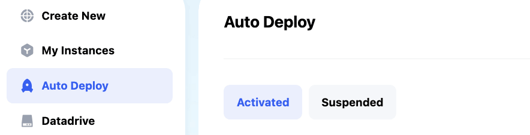
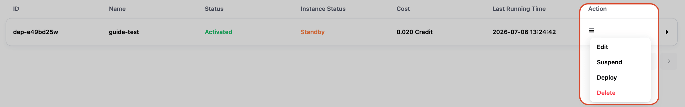
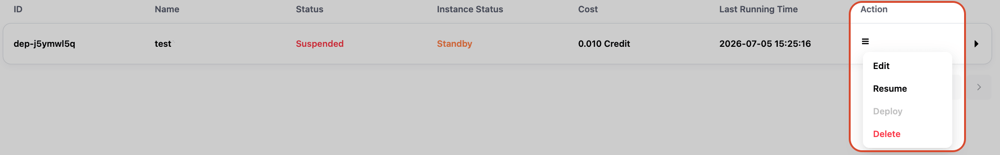
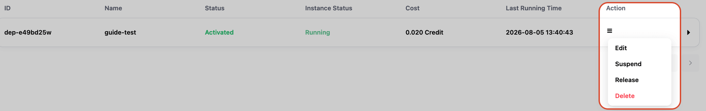
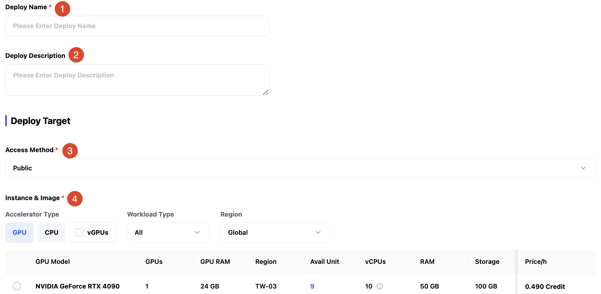
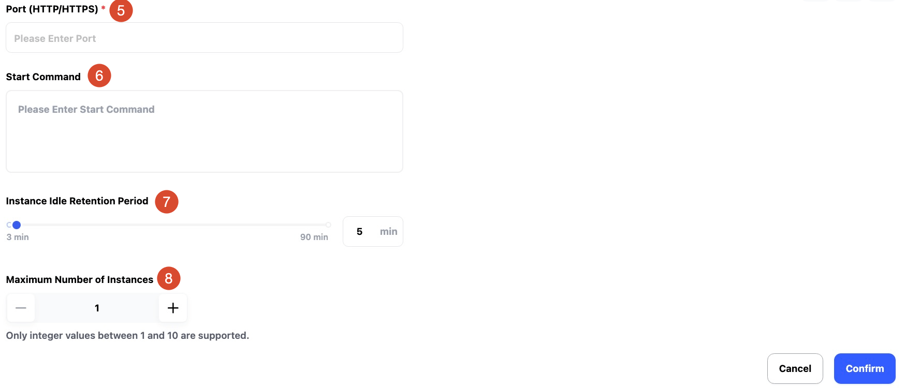
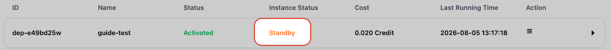
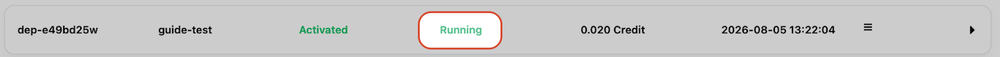

# 自動部署

在 **Auto Deploy** 頁面，您可以配置並自動化部署流程，使您的應用程式能夠高效、安全地運行。以下是詳細功能介紹：

---

## **Auto Deploy 狀態**

在 **Auto Deploy** 頁面中，您可以看到兩種部署狀態：

1. **Activated**：自動部署已經啟用，隨時待命。
2. **Suspended**：自動部署服務已暫停，未在運行中。

**每個部署任務列表包含以下欄位**：

- **ID**：每個部署任務的唯一標識符。
- **Name**：部署任務名稱。
- **Status**：當前部署狀態（Activated、Suspended）。
- **Instance Status**：實例的當前運行狀態（如 Standby、Running）。
- **Cost**：此部署消耗的資源費用（如 `0.000 Credit`）。
- **Last Running Time**：最近一次運行的時間。
- **Action**：可對部署進行的操作（詳見下方操作介紹）。

---

## **Auto Deploy 可執行的操作**

在 **Action** 欄位提供以下操作：

### **1. Edit**

- **功能**：編輯部署配置。
- **使用情境**：當需要修改部署名稱、環境變數或其他設定時在此進行操作。

### **2. Suspend**

- **功能**：暫停部署，停止應用程式的運行。
- **使用情境**：當不再需要運行應用程式時，可暫停部署節省資源成本。

### **3. Deploy**

- **功能**：啟動或重新部署應用程式。
- **使用情境**：透過設定好的 AutoDeploy 啟動實例，此功能相當於使用 AutoDeploy 提供的 URL（URL 詳情可見使用者教學中的`Glows.ai Auto Deploy 使用案例`篇章）。

### **4. Delete**

- **功能**：刪除部署任務。
- **使用情境**：當不再需要此自動部署時，可刪除部署任務，**刪除後無法恢復**。

### **5. Resume**

- **功能**：恢復已暫停的自動部署設置。
- **使用情境**：當自動部署設置處於 Suspended 狀態且需要重新啟動時，可使用此操作使其回到 Activated 狀態，之後可點擊 `Deploy` 來部署實例。

### **6. Release**

- **功能**：將透過自動部署開啟的實例釋放，將實例轉為 Released 狀態。
- **使用情境**：當不需要使用已部署的實例時，可點擊 `Release` 來釋放資源並停止費用計算。

---

## **New Deploy 操作流程**

### **步驟 1：設定規則資訊**

點擊右上角的 `New Deploy` 按鈕時，將會出現一個表單，您需要填寫以下資訊來創建新的部署：

1. **Deploy Name**：輸入部署名稱。
2. **Deploy Description**（選填）：可提供簡短描述。
3. **Access Method**：選擇存取方式（目前僅支援 `Public`）。
4. **Instance & Image**：選擇要部署的實例與映像檔。
5. **Region**：選擇部署區域。
6. **Port**：填寫要使用的端口。
7. **Start Command**（選填）：透過此自動部署啟動的實例在啟動後自動執行的指令。
8. **Maximum Number of Instances**：填寫透過此自動部署能開啟的最大實例數量。

### **步驟 2：確認部署**

1. 完成表單填寫後，點擊 `Confirm`。
2. 系統將開始部署應用程式。
3. 部署成功後，應用程式狀態將顯示於 **Activated** 列表中，代表您的自動部署設置已經待命，等候您調用。
4. **Instance Status** 顯示 `Standby` 代表此自動部署正等待您調用，`Running` 表示當前已透過此自動部署開啟了實例

---

## **注意事項**

- **應用刪除不可逆**：刪除應用後，無法恢復。

- **暫停可節省資源**：想暫時停用一個自動部署的設置，可選擇 `Suspend`。

- **確認設定後再部署**：確保設定正確，以避免部署錯誤。

---

**以上是關於 Auto Deploy 的完整指南，如需更詳細的操作步驟與案例，請參考 [**Glows.ai Auto Deploy 使用說明**](https://docs.glows.ai/docs/auto-deploy-usage)。**
