# Bind Public IP

**Bind Public IP** 是 **Glows.ai** 提供的公開 IP 管理功能，讓您可以建立獨立的 **Public IP** 資源，並綁定至指定的實例，使實例能夠對外提供服務或被外部存取。您也可以透過 **IP ACL** 規則，進一步控管此 **Public IP** 的入站（Inbound）與出站（Outbound）流量，確保僅有經過授權的來源與埠號能夠存取您的服務。

本文將依序說明：
1. 如何建立 **Public IP**
2. 如何將 **Public IP** 綁定至實例
3. 如何設定 **IP ACL** 規則以控管存取權限

---

## 建立一個 Public IP

首先點擊左側功能列表的 `Network Endpoint`，並點擊 `Create New`，開始建立一個 **Public IP**。
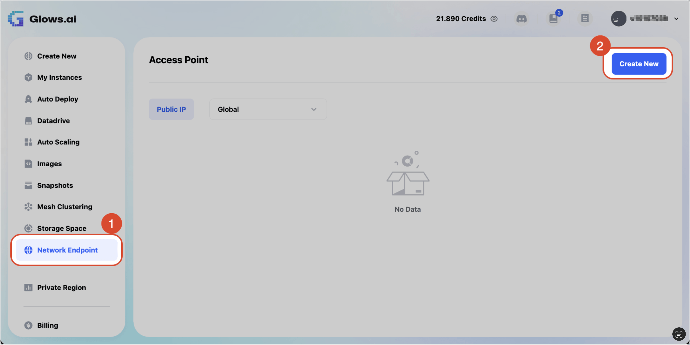

選擇 **Region** 及 **IP Bandwidth Type** 後，點擊 `Create` 即可建立 **Public IP**。

請注意，此 **Public IP 的** Region 必須與後續欲綁定的實例使用相同的 Region，選擇前請仔細確認。
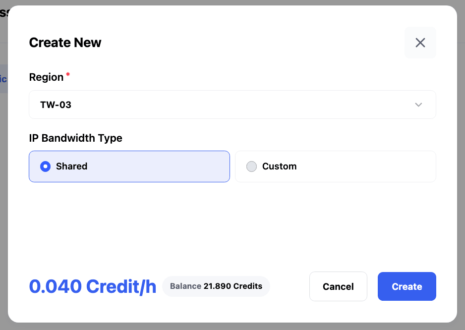

建立成功之後，在列表中即可看到該 **Public IP**，代表已就緒，您可以在建立實例時綁定。
請注意，**Public IP** 為獨享資源，建立完成後，就算未掛載實例，也會持續消耗 Credit，請確認您的使用需求後再進行建立。

列表中的每一個 **Public IP** 包含以下欄位：
- **ID**： 每個 **Public IP** 的唯一標識符。
- **Address**：**Public IP** 地址。
- **Region**：所在的區域（如TW-03）。
- **Bandwidth**：頻寬類型（如Shared、Custom）。
- **Status**：狀態（如 Available）。
- **Cost**：此 **Public IP** 當前已消耗的 Credit。
- **Action**：可對此 **Public IP** 執行的動作。
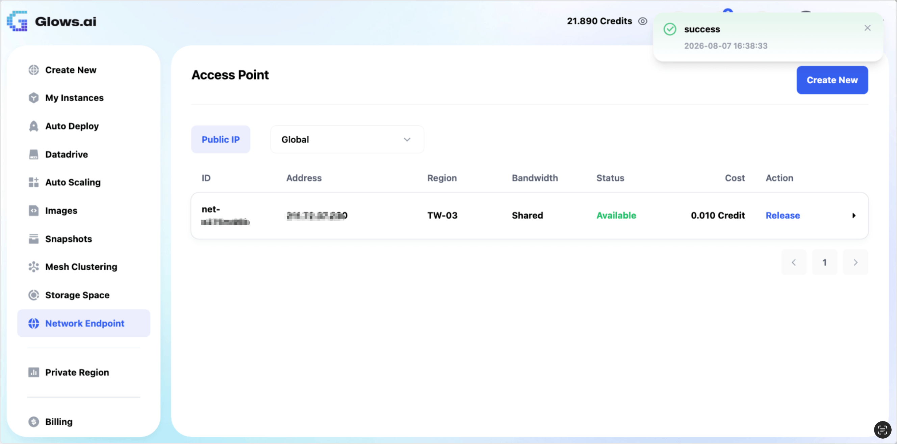

---

## 綁定 Public IP

成功建立之後，即可於建立實例時綁定。
請注意，建立實例時，請選擇與欲綁定的 **Public IP** 相同的 Region。
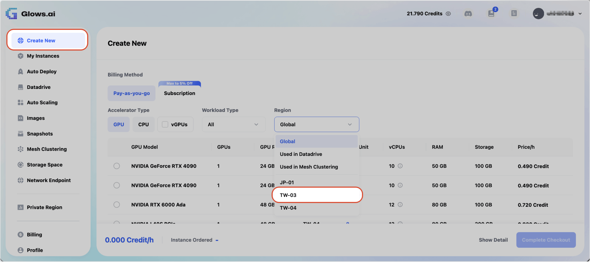

在建立實例時，於選單下方的 **Public IP Address** 點擊 `Bind` 。
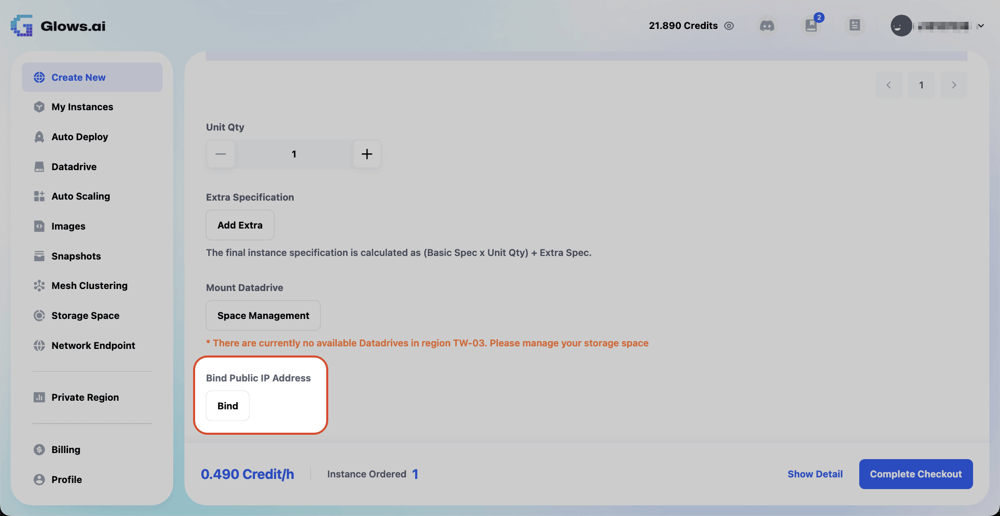

在彈窗中選擇您欲綁定的 **Public IP** 後，選擇 `Protocol` 並填入 `Port` 即可點擊 `Bind` 進行綁定。
若您建立了多個 **Public IP**，與實例相同 Region 的 **Public IP** 將會顯示在此列表中供您選擇。
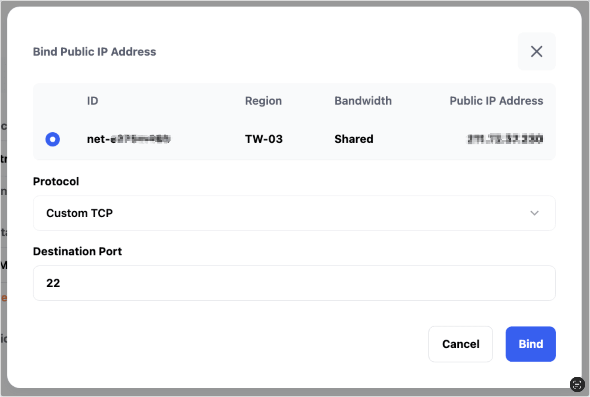

成功綁定之後，將會顯示該 **Public IP** 的資訊。確認無誤後，即可建立綁定了 **Public IP** 的實例。
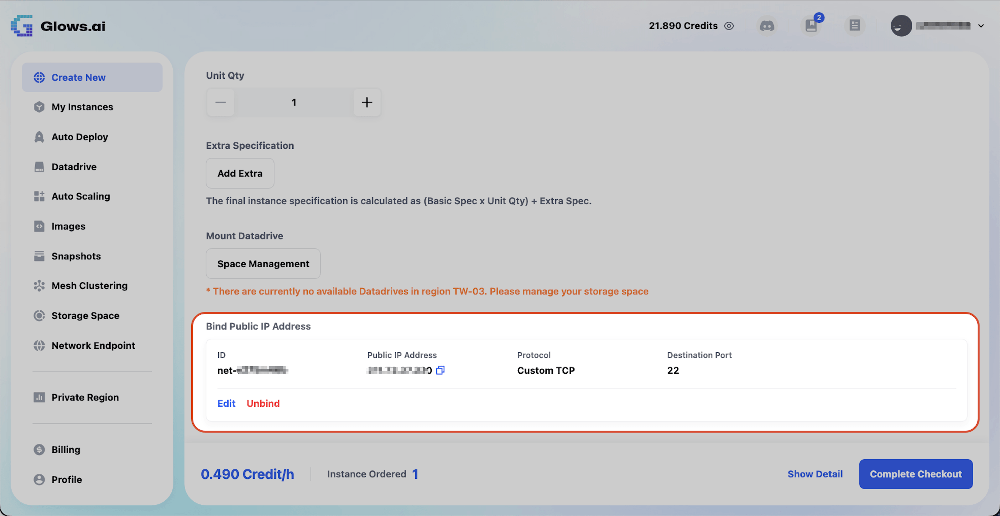

建立實例後，您可以在實例列表中，看到該實例成功綁定的 IP 地址。
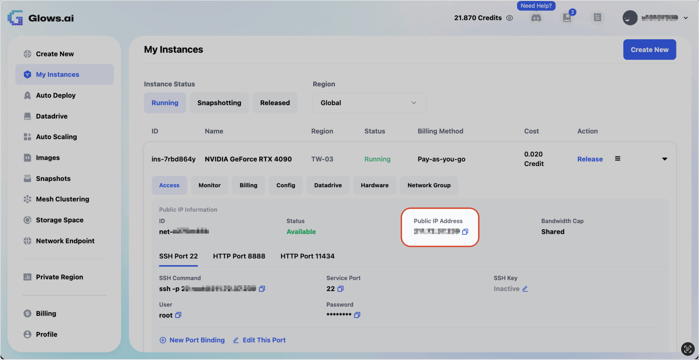

---

## IP ACL 設定 

每個 **Public IP** 都可以綁定 **ACL** 規則，用來控管此 IP 的對外存取權限與網路流量方向。
1. 點擊 `Network Endpoint` 後，點選您要進行設定的 **Public IP**。
2. 點擊 `IP ACL`。
3. 點擊 `Add ACL Resource`。
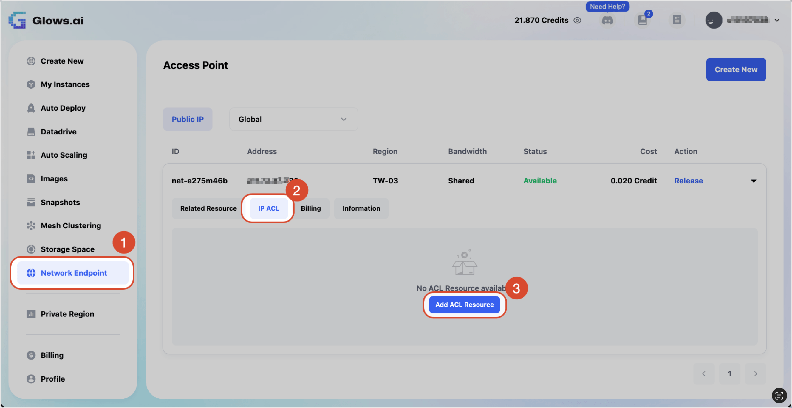

點擊 `Add ACL Resource` 後，即會建立 **IP ACL**，接著點擊 `Manage Rules` 開始進行設定。
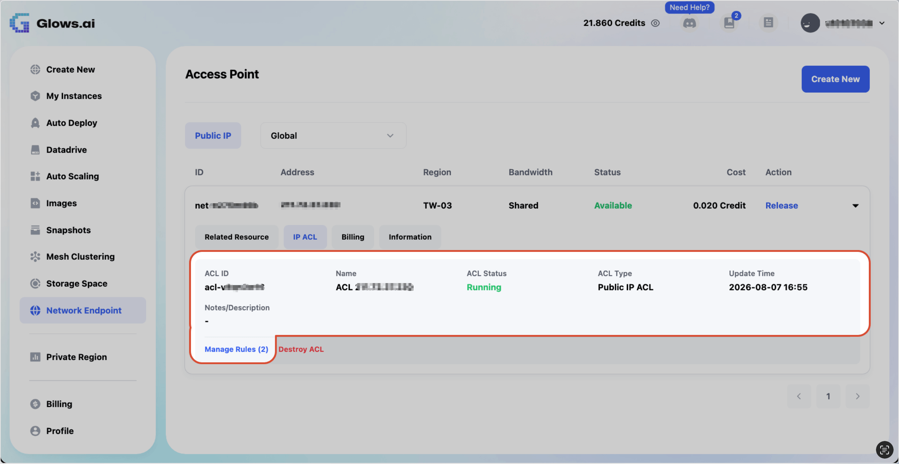

此頁面顯示了此 **Public IP** 目前所有的 **ACL** 規則列表，**ACL** 依方向分為兩種：
  > **Inbound**：入站規則。控制外部哪些來源可以存取此 IP，用以限制可連入此服務的來源範圍。
  
 > **Outbound**：出站規則。定義此 IP 允許連線的目標 IP 範圍，用以控管此服務可對外連線的範圍。

您可以看到 ACL 規則的各個資訊欄位：
- **Remote CIDR**： 來源或目標的 IP 範圍，以 **CIDR** 格式表示（例如 `0.0.0.0/0` 代表所有 IP）。
- **Direction**：此規則的方向，為 `Inbound`（入站）或 `Outbound`（出站）。
- **Default Policy**：套用於 **Remote CIDR** 的規則動作，`Deny` 為拒絕、`Allow` 為允許。
- **Status**：規則的生效狀態（例如：`Pending` 為待生效、`Applied` 為已套用）。
- **Description**：用戶對此 **ACL** 撰寫的描述。
- **Created Time**：此 **ACL** 規則建立的時間。
- **Action**：可對此 **ACL** 執行的動作。
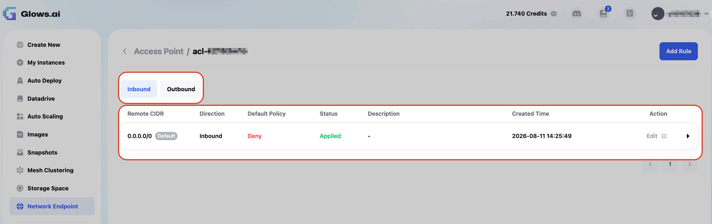

系統預設會建立一條 `Inbound` 規則：**Remote CIDR** 為 `0.0.0.0/0`（代表所有來源 IP），此規則的 **Default Policy** 為 `Deny`，代表預設拒絕所有外部來源連入此 IP。

為了開放特定來源存取，接著請點擊 `New L4 Rule` 新增例外規則。
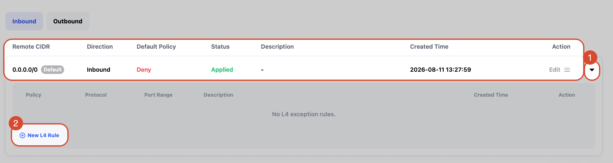

開始設定 **L4 Rule**：
1. 系統提示 ：此 **L4** 規則隸屬於 **L3** 規則 `0.0.0.0/0`（Default Policy: Deny）之下，因此 **L4 Policy** 只能設定為 `Allow`（為了從全面拒絕中，開放出特定的例外連線）。
2. **Destination Port**：填入欲開放的目的埠範圍，例如 8000 至 8888。若僅需開放單一埠號，可於兩個欄位填入相同數值，例如 `8000` 至 `8000`。
3. 確認欲開放的埠號範圍無誤後，點擊 `Add` 將此設定加入規則清單。
4. 點擊 `Create L4 Rule`，完成規則建立。
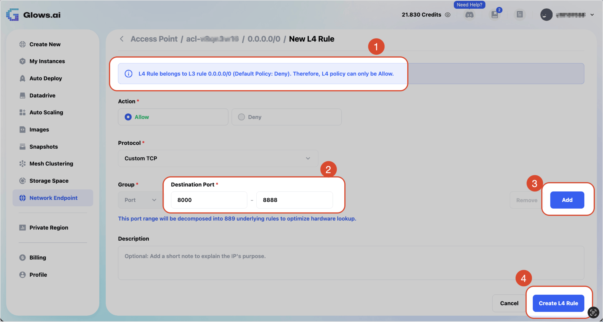

**L4 Rule** 建立完畢之後，會隸屬於 **L3** 規則 `0.0.0.0/0` 底下的例外規則列表中。此時該筆規則的 Policy 為 `Allow`，代表在預設拒絕所有連線（L3 的 Deny 規則）的前提下，僅開放 8000 至 8888 埠號範圍的連線。

L4 Rule 列表中的資訊：
- **Policy**：此 **L4** 規則的動作，因爲隸屬於為 `Deny` 的 **L3** 規則，故僅能為 `Allow`。
- **Protocol**：此規則適用的通訊協定（例如 Custom TCP）。
- **Port Range**：此規則開放的目的埠號範圍，例如 8000-8888。
- **Description**：用戶對此 **L4** 規則撰寫的描述。
- **Created Time**：此 **L4** 規則建立的時間。
- **Action**：可對此規則執行的操作，例如編輯（Edit）。
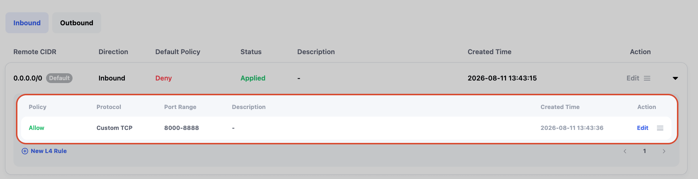

---

## 多個實例綁定同一個 Public IP

在建立時綁定該 **Public IP** 的各個實例，將會顯示在清單底下。
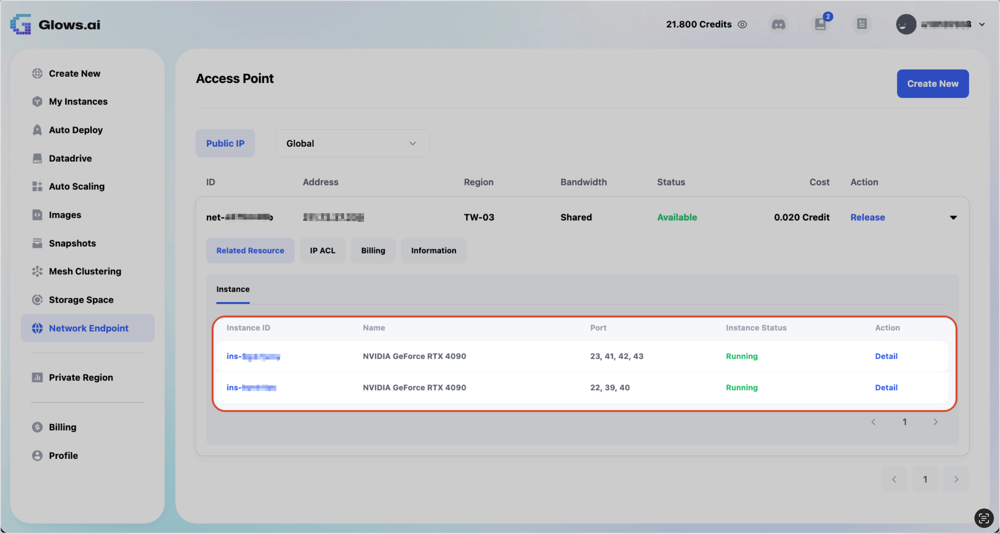

---

## 聯繫我們

如在使用 **Glows.ai** 過程中遇到任何問題或有建議，歡迎透過以下方式聯繫我們：

**Email:** [support@glows.ai](mailto:support@glows.ai)

**Discord:** [https://discord.com/invite/glowsai](https://discord.com/invite/glowsai)

**Line:** [https://lin.ee/fHcoDgG](https://lin.ee/fHcoDgG)

