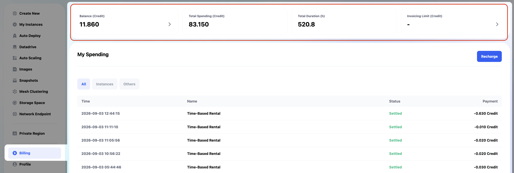
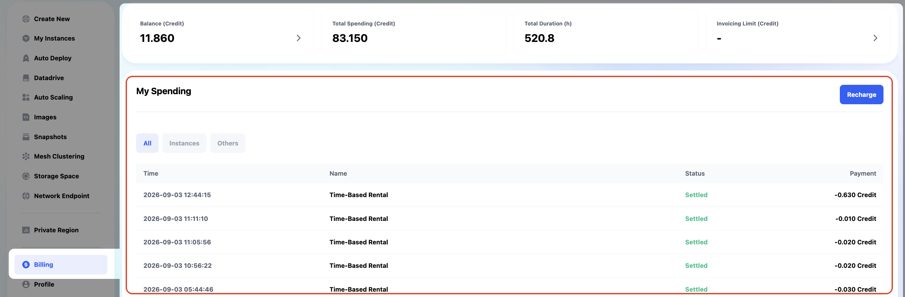
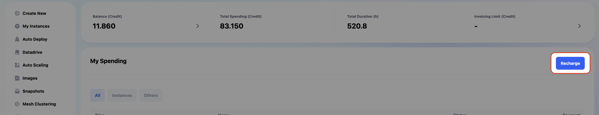
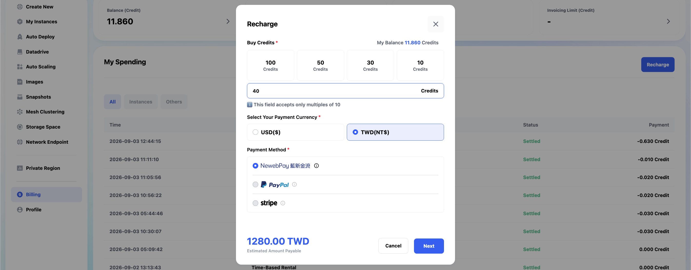

# 帳單系統

在 **Billing** 頁面，您可以查看和管理您的支出與餘額。

## Billing 主頁面 
### 上方總儀表板

- **Balance (Credit)**：當前餘額，例如 11.160。點擊能查看 Credit 詳情，以及儲值。
- **Total Spending (Credit)**：總支出，例如 83.150。
- **Total Duration (h)**：總使用時間，例如 520.8 小時。
- **Invoicing Limit (Credit)**：目前無限制。

### My Spending

- 顯示每筆消費的詳細資訊，包括 **Time, Name, Status, Payment**。
- 您也可以透過消費類型做篩選，包括 **Instances, Others**。

### Recharge

## **儲值 Credits**

1. 點擊**My Spending** 右方的 `Recharge` 按鈕
2. 點選後進入儲值畫面，顯示 **My Balance** 及 **Buy Credit** 選項。
   > 您可以選擇預設額度或自訂儲值金額。
3. 選擇 **Payment Currency**（目前支援 USD 和 TWD）。
4. 選擇 **Payment Method**（目前支援 PayPal 和 NewebPay）。
5. 勾選 **I have read and agree to the EULA** 。
6. 確認顯示金額是否正確，確認後點擊 **Recharge** 完成儲值。

