# Glows.ai 多模型路由服務 Model Route 使用教學

## 什麼是 Glows.ai Model Route 服務？

Glows.ai **Model Route** 是專為開發者與企業打造的一站式 AI 模型聚合與路由平台。我們將市面上所有頂尖的、國內外熱門的模型全部整合於同一組 API Key 管理之下，讓您無需再為繁瑣的跨平台申請、多帳單管理與金鑰維護感到頭痛。

無論是文字對話、圖像生成、影片創作、語音辨識還是嵌入（Embedding），只要透過 Glows.ai 的單一介面就能無縫串接。平台不僅提供極具競爭力的實惠價格，更支援全面接入各類主流 AI Agent 開發框架與工具，讓您用最低的成本、最快的速度解鎖無限的 AI 應用可能。

| 核心優勢         | 說明                                                         |
| ---------------- | ------------------------------------------------------------ |
| **模型大而全**   | 完整收錄海內外熱門大模型，涵蓋各大主流廠商最新旗艦模型，比如 GPT-5.6 Sol、Claude Fable 5、Qwen 3 8 MAX 等 |
| **多模態支援**   | 全面支援文字、圖像、影片、語音與向量嵌入（Embedding），滿足多元業務場景 |
| **單一 API Key** | 一個 API Key 搞定所有模型呼叫，減少多平台帳號管理與分散計費管理的複雜度 |
| **Agent 友善**   | 完美支援接入各類熱門 AI Agent 開發工具與自動化框架           |
| **透明計費**     | 點進單頁即可即時查看各模型的詳細費率、能力對比與使用範例程式碼 |

### 支援的模型與 Agent 生態

- **全方位多模態模型**：支援市面上主流的文字、圖像、影片、語音處理與嵌入模型，隨選隨用。
- **熱門 AI Agent 框架與工具**：全面支援串接各類主流開發與編碼 Agent，如 Codex、Claude Code、OpenCode、OpenClaw、Hermes、DeepSeek Harness 等，助您輕鬆打造專屬的智慧化工作流程。

## 建立 Model Route

登錄 Glowsai platform 後，點擊左側功能欄的`Model Route`即可進入 Model Route 配置使用介面，繼續點擊`New Route`建立一個路由配置。

```bash
https://platform.glows.ai
```

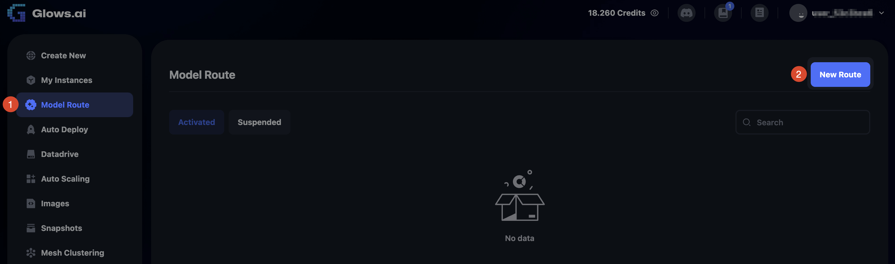

在 New Model Route 介面，我可以輸入以下資訊：

- Route Name: Model Route 配置名稱，可以用作使用類別或渠道區分
- Route Description: Model Route 配置詳細描述
- Route Type: Model Route 配置上游模型供應商，有三種模式：
  - MaaS 表示 Model as a Service ，模型來自平台內置的模型供應商，如：GPT、Claude、Qwen 等。
  - Instance 表示模型來自 Platform 內的某個實例。
  - Auto Deployment 表示模型來自Platform 配置的 Auto Deploy 服務。

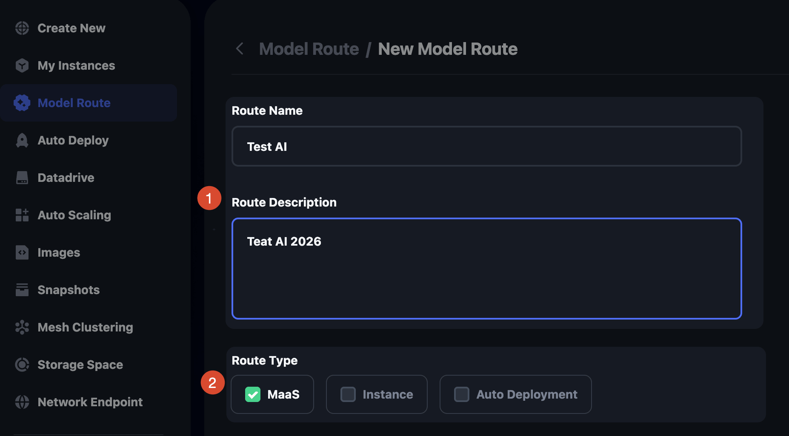

Route Type 目前僅支援 MaaS 模式，選擇後可以查看模型列表，並進行模型供應商/模型篩選，勾選計劃使用的模型，然後繼續下一步。

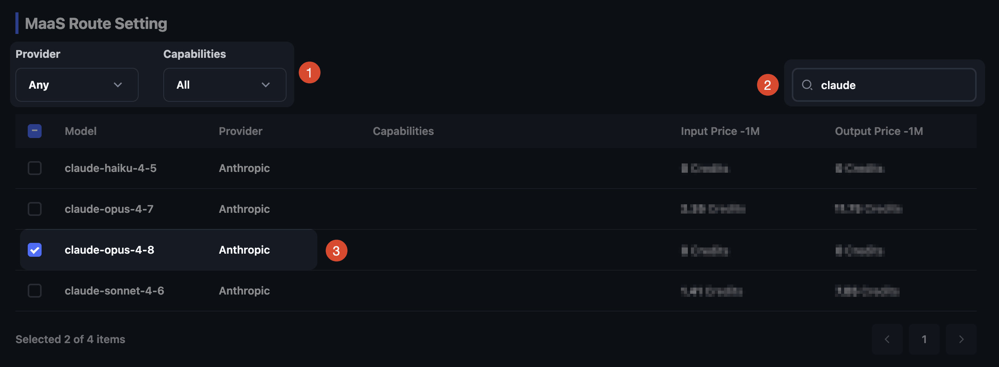

Access Method 可以配置模型訪問方式，目前默認為常見的 API Key 方式訪問，直接點擊`Confirm`。

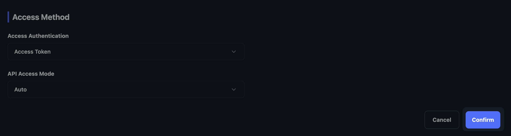

會再次顯示您本次選擇的模型列表和模型價格資訊，確認無誤點擊彈框中的 `Confirm` 按鈕完成建立。

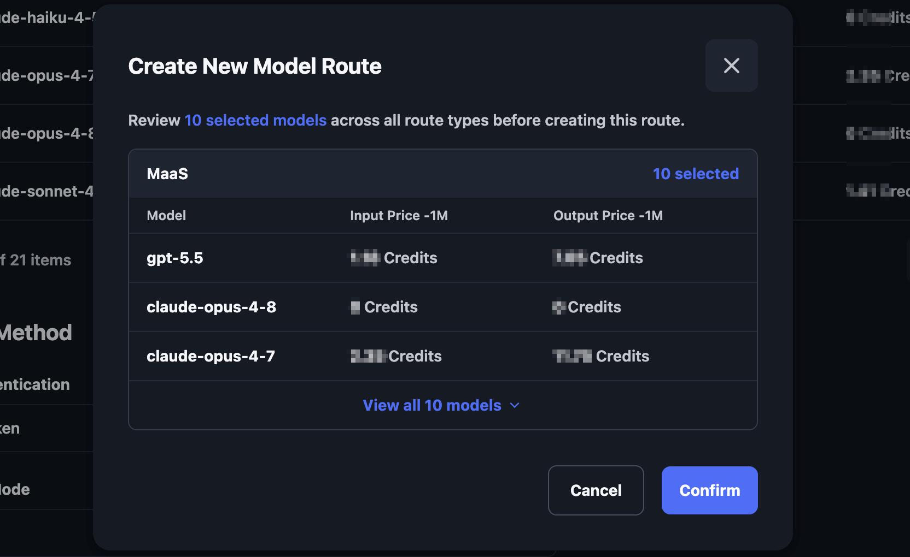

建立配置完成後會彈框顯示 Route API Key，該 Key 只會在建立的時候顯示一次，您需要先點擊 `Copy` 按鈕複製 API Key 儲存到本地，然後再點擊 `Done`按鈕關閉介面。 

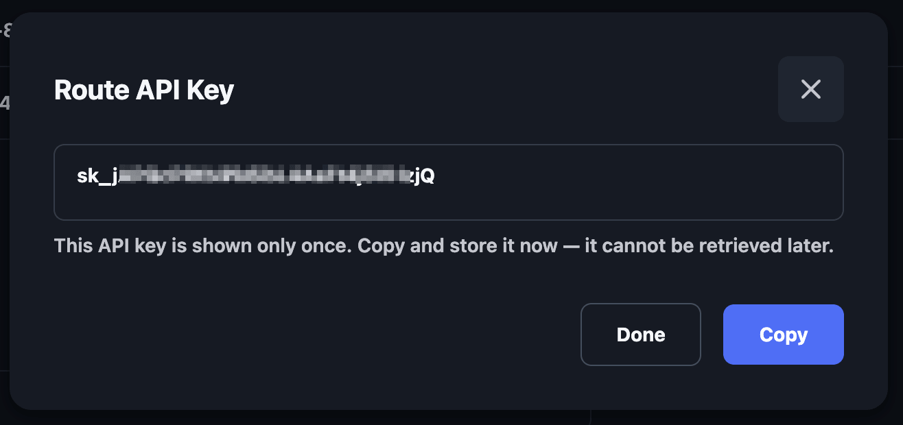

## 查看 Model Route 資訊

建立完成後可以看到 Model Route 列表，裡面展示了基礎資訊，其中 ID 主要用於售後，在遇到問題後把 Model Route  ID 隨問題一起發給客服，方便更快定位和解決您遇到的問題。

點擊 Action 下的按鈕，可以進行以下操作：

- Edit: 編輯 Model Route 資訊
- Suspend: 暫停 Model Route 使用
- Delete: 刪除 Model Route 配置

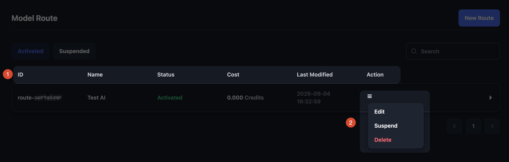

點擊該 Model Route 配置項，可以看到更多相關資訊，首先是 `API Access`，裡面會顯示該 Model Route 配置對應的唯一 Access URL，以及各種系統下的測試指令。

同時在這個介面還可以點擊底部的 `Rotate Credential` 重置 API Key。（**注意：**重置生成新的  API Key 後，舊的  API Key 會立即失效）

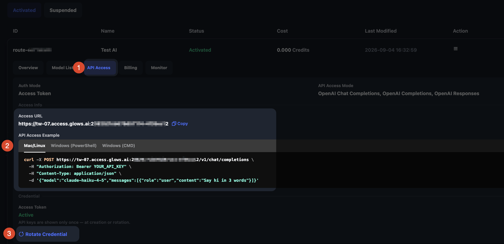

在 `Model List`裡可以看到當前配置的可用模型列表，也可以在這個介面點擊底部 `Manage` 按鈕對模型列表進行管理：新增或移除可用模型。

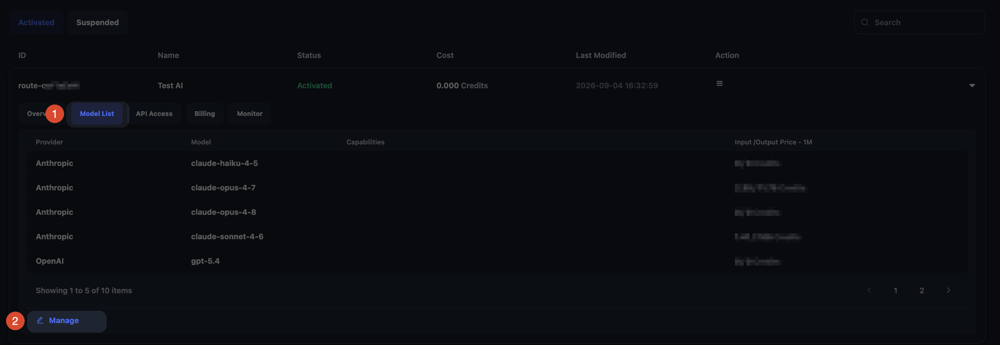

## 接口 curl 使用說明

Glows.ai Model Route 支援 OpenAI Compatible API、Anthropic Messages API 等業界主流接口格式，無需修改原有應用架構，只需替換 API Endpoint 與 Key，即可快速接入 GPT、Claude、DeepSeek、Kimi 等國內外熱門模型。

以 OpenAI Compatible API 为例子：

1、查看模型列表

```bash
curl -X GET \
  "https://tw-07.access.glows.ai:2xx9/7cxxx12/v1/models" \
  -H "Authorization: Bearer YOUR_API_KEY" \
  -H "Content-Type: application/json"
```

2、使用接口呼叫模型進行推論

```bash
curl -X POST \
  "https://tw-07.access.glows.ai:2xx9/7cxxx12/v1/chat/completions" \
  -H "Authorization: Bearer YOUR_API_KEY" \
  -H "Content-Type: application/json" \
  -d '{
    "model": "claude-opus-4-8",
    "messages": [
      {
        "role": "user",
        "content": "Say hi in 3 words"
      }
    ]
  }'
```

## AI Agent 配置 Model Route

### 支援的 Agent 工具

目前 Glows.ai Model Route 可搭配以下常見 AI Agent 工具使用：

- **Codex**：支援 OpenAI Responses API / Agent 工作流
- **Claude Code**：支援 Anthropic Messages API 格式
- **OpenCode**：支援 OpenAI Compatible API 模型配置
- **OpenClaw**：支援自訂模型 Endpoint 與 API Key 配置
- **Hermes Agent**：支援 OpenAI Compatible 模型接入
- **DeepSeek Harness**：支援 DeepSeek 及其他相容模型呼叫

不同 Agent 工具的詳細配置方式可能略有差異，請依照各工具官方設定方式填入 Glows.ai Model Route 提供的 API Endpoint 與 API Key 即可。

### 使用 CCSwitch 配置 Model Route

CCSwitch 是一款支援多種 AI Agent 與模型配置管理的工具，可以協助開發者快速管理 OpenAI、Claude 等不同模型服務。

CCSwitch 安裝包下載地址：[點擊進入](https://github.com/farion1231/cc-switch/releases)

使用 Glows.ai Model Route 時，只需要在 CCSwitch 中新增對應的 API 配置：

| 配置項目         | 說明                                                         |
| ---------------- | ------------------------------------------------------------ |
| **API Provider** | 選擇對應的模型服務類型（OpenAI Compatible / Anthropic Compatible） |
| **API Key**      | 填入 Glows.ai Model Route 生成的 API Key                     |
| **API Endpoint** | 填入 Model Route 提供的 Access URL                           |
| **Model Name**   | 填入 Model Route 中已啟用的模型名稱                          |


安裝好後先點擊自己需要配置的 AI Agent，以 Codex 為例子，如圖所示，先點擊 Codex 圖標，然後點擊右上角 `+` 添加配置。

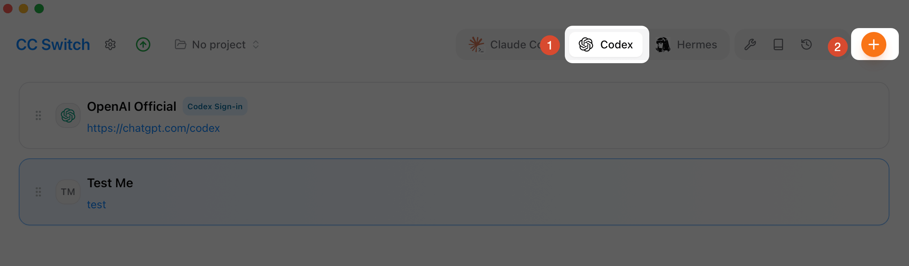

配置介面直接下滑到輸入 Provider 資訊的部分，第一步是輸入描述資訊，比如名字、備註、官網 URL（可選填，和備註一樣是用於自己區分使用），然後設置我們前面建立 Model Route 獲取到的 API URL和 API KEY，最後填寫默認使用的模型，直接手動輸入即可，比如：gpt-5.6-luna。

注意：使用模型必須是你建立 Model Route 時有勾選的模型，不然使用會報錯找不到模型。

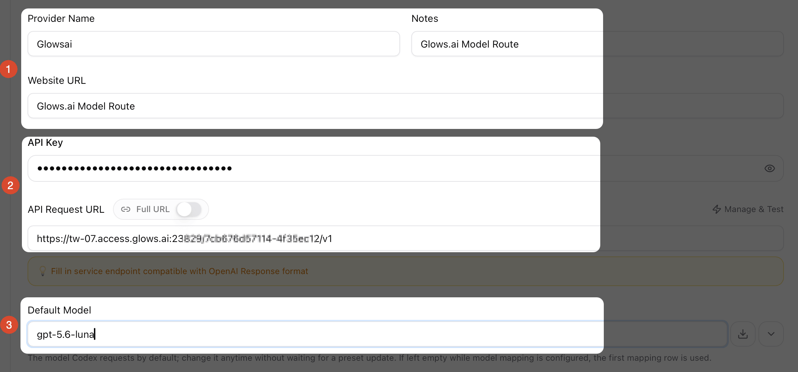

其他選項默認值即可，直接點擊 `Add` 按鈕完成配置。

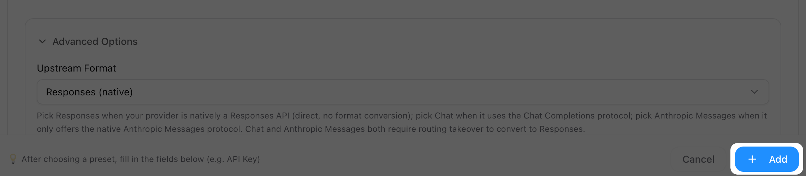

建立完成後，點擊 `Enable` 即可前往 Codex 使用了。

**注意：**切換 Provider 後，需要重啟 Codex APP 才會生效。

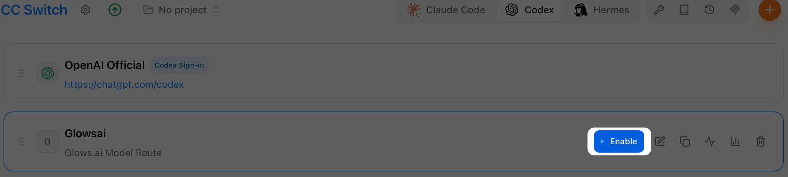

## FAQs

**1、目前使用流程是什麼樣的？**

目前服務已正式上線。您可以按照教學中的[建立 Model Route](#建立 Model Route)步驟建立 Model Route 並獲取 API URL 和 API KEY，然後按照[接口 curl 使用說明](#接口 curl 使用說明)和[Agent 配置 Model Route](#Agent 配置 Model Route)步驟操作即可開始使用。

**2、支援在 Codex 和Claude Code 內使用嗎？**

支援，目前 Model Route 除了支援 Codex、Claude Code，還支援常見的 Hermes Agent、OpenCode、OpenClaw 等AI Agent 工具配置使用，使用參考[AI Agent 配置 Model Route](#AI Agent 配置 Model Route)。

## 聯繫我們

如果您在使用 Glows.ai 的過程中有任何疑問或者建議，歡迎通過郵件、Discord 或者 Line 聯繫我們。

**Email:** [support@glows.ai](mailto:support@glows.ai)

**Discord:** [https://discord.com/invite/glowsai](https://discord.com/invite/glowsai)

**Line:** [https://lin.ee/fHcoDgG](https://lin.ee/fHcoDgG)
